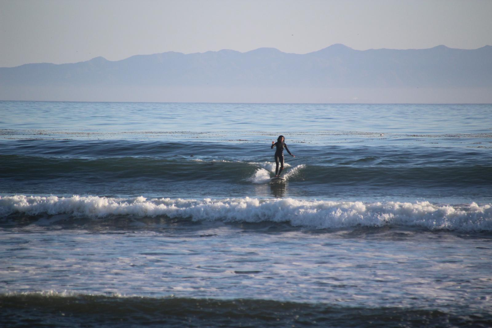

::: {.panel-tabset}

## Bio

{width="250px" style="display: block; margin: 0 auto 1em auto;"}
Here's a polished version:

---

I'm a Master of Environmental Science and Management graduate from the Bren School at UC Santa Barbara, specializing in coastal resource management with a focus in environmental communication. My work spans marine conservation and applied research along the California Current, with an emphasis on science communication and data visualization. I'm interested in using visual storytelling to make environmental data accessible and give agency to the communities and institutions whose story it is telling.

I've been part of long-term monitoring efforts including [ACCESS](https://accessoceans.org/) and [keystone datasets on the Farallon Islands](https://www.pointblue.org/our-work/keystone-datasets/). My field experience includes one season as a preventative search and rescue volunteer in Hetch-Hetchy, Yosemite National Park,  two seasons of seabird and pinniped monitoring on the Farallon Islands National Wildlife Refuge, diet composition work with California least terns in Baja California, and coordinating [marine debris cleanups on the Channel Islands](https://marinesanctuary.org/goal-clean-seas-channel-islands/).

Currently, I'm a researcher with the [Save the Blue 5 project](https://savethebluefive.net/) with Conservation International, working across five countries in Central and South America alongside taxonomic experts, researchers, and climate modelers. Our team is authoring a climate change assessment for 11 transboundary marine megafauna species, combining historic literature with in-progress modeling to directly inform conservation policy.

I'm from California, raised on Chumash lands, and currently working on Chumash lands and waters. In my free time I host a weekly radio show on [KCSB FM Chaat Room] (https://spinitron.com/KCSB/show/292747/Chaat-Room), which is all Cumbia & South Asian beats. I also love to spent time outside and can often be found tidepooling, running around outside with my dog, and surfing point breaks from Devereaux to First Point. In the city you can usually find me dancing cumbia. 

Learning about California's terrestrial and marine ecology is what first made me feel connected to this place, and I have dedicated my life to give back to it. With a background in applied conservation science and place-based research, I hope to work at the intersection of regional policy and science, focusing on ecosystem-based adaptation strategies and coastal resilience for both communities and ecosystems.

---

## CV

```{=html}
<iframe src="Ramnath_CV.pdf" width="100%" height="800px" style="border:none;"></iframe>
```

:::