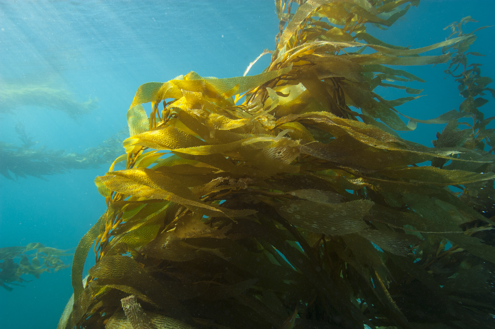
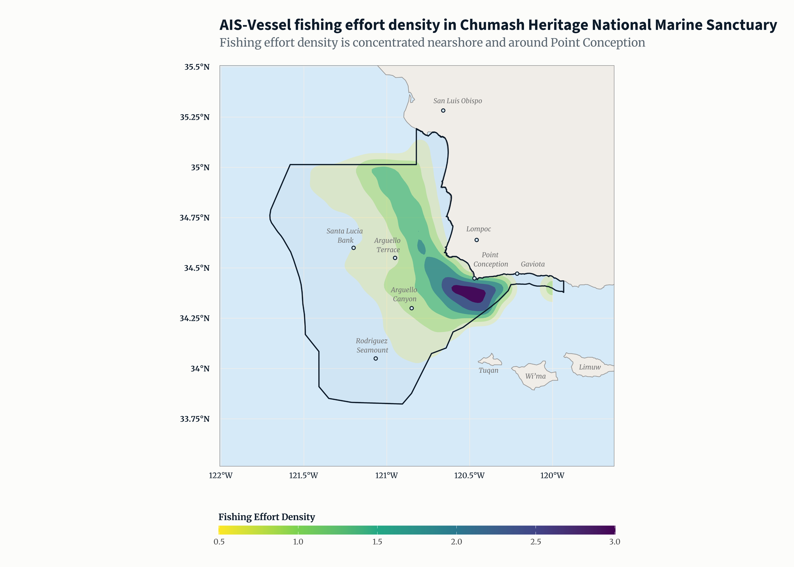
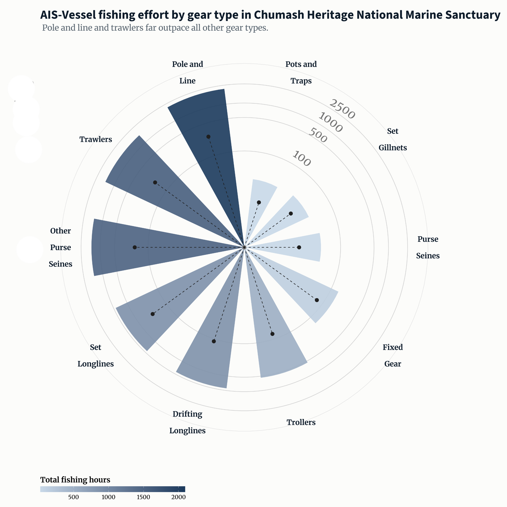
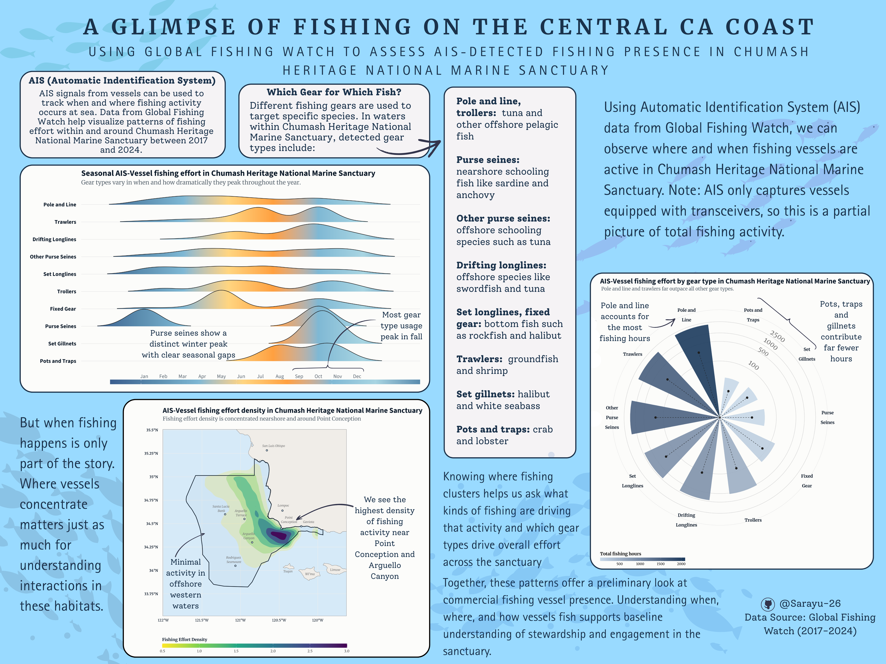

## Reading the Waters with Global Fishing Watch: What AIS Data Reveals About Fishing Activity in California's Newest National Marine Sanctuary

### Spawning Idea

I’ve been exploring fishing activity in Chumash Heritage National Marine Sanctuary (CHNMS), which stretches along the central California coast from Gaviota to just south of Morro Bay and protects a variety of nearshore and offshore marine habitats.This area is a remarkably biodiverse stretch of ocean. It is anchored by Point Conception , where cold northern currents collide with warmer southern waters, creating a unique mixing zone that supports an extraordinary range of life. Underwater, forests of giant kelp (Macrocystis pyrifera) rise from rocky reefs, their canopies filtering sunlight into shifting green-gold rays. Sea otters wrap themselves in kelp fronds to sleep, rockfish tuck into crevices below, and spouts of gray whales and humpback whales can be seen from shore as they swim along the coast during their annual migrations. These nearshore and offshore underwater forests are home to fish, invertebrates, seabirds, marine mammals, and for the coastal communities that have held relationships with these waters for thousands of years. I wanted to better understand human interactions within the sanctuary, especially fishing, because it's a key piece of understanding how we can engage with and steward these waters.

{fig-alt="Underwater view of a giant kelp (Macrocystis pyrifera) forest at Cojo Anchorage near Point Conception, California. Tall kelp fronds rise from the rocky reef toward the surface, with light filtering through the canopy. Credit: Robert Schwemmer, NOAA" fig-align="center" width="10in"}

Understanding preliminary fishing activity in the area was a little tricky. The sanctuary sits between two active harbors: Morro Bay Harbor to the north and Santa Barbara Harbor to the south. For the average public data parser and fisheries amateur, it makes it hard to know exactly what’s being caught and where. Catch landing data is reported at the harbor level, not the sanctuary level, so I couldn't tell whether a fish and which gear type used was caught inside the sanctuary or somewhere outside and just landed nearby.

To get around this, I looked at vessel tracking data from [[Global Fishing Watch]{.underline}](Globalfishingwatch.org) (GFW), a nonprofit organization that uses satellite technology and machine learning to monitor global fishing activity in near real-time and makes this data publicly available. They collect Automatic Identification System (AIS) signals from vessels, which broadcast location, speed, and heading. Many large commercial vessels are required to carry AIS (\>65ft long), and some smaller vessels do so voluntarily. Using AIS data lets us get an idea of where and when fishing vessels are active, even if catch records are limited. Of course, there are caveats: many smaller vessels don’t carry AIS, and this data doesn’t include recreational, cultural, or subsistence fishing. Still, it gives a useful glimpse into fishing vessel presence in the sanctuary.

## AIS-Detected Fishing (2017–2024)

For CHNMS, AIS-detected fishing data from **2017–2024** provide a snapshot of fishing activity within and around the sanctuary. This information helps illustrate patterns of ocean use and the presence of industrial fishing vessels over time.

## Visualization Questions

I wanted to answer three questions: **when, where, and what.** Each is represented with a different visualization.

### **1. Seasonal Patterns: Ridgeline Plot**

To look at **when** fishing activity happens, I created a ridgeline plot showing seasonal use of different gear types from 2017–2024. This plot organizes fishing effort by month and gear type, so I can see patterns, overlaps, and differences across the year. Some gears are used year-round, while others have clear seasonal peaks. Looking at this would help understand timing in fishing activity and how different gear types may overlap or remain separate during the year.

{fig-alt="Alt-Text: Ridgeline plot showing seasonal fishing effort by gear type in Chumash Heritage National Marine Sanctuary. Fishing activity peaks in fall, with strong overlaps among trawlers, purse seines, set gillnets, and pots and traps between September and November. The color gradient encodes seasonality, transitioning from dark blue in December to March, to lighter blue in April, shifting to yellow and orange during the summer months from June to August, and returning from lighter blue to darker blue in October through December." width="12in"}

### **2. Spatial Hotspots: Density Map**

Next, I explored **where** fishing activity is concentrated. Using the latitude and longitude coordinates from AIS, along with fishing hours, I made a density hotspot map. This lets us view areas with higher vessel presence versus more diffuse activity. Hotspots shows where fishing pressure is greatest and where it might overlap with sensitive habitats or biologically important areas, which I marked several offshore geological featrures. The density map is a clear way to visualize spatial concentration across the sanctuary.

{fig-alt="Density map of AIS-detected fishing vessel effort in Chumash Heritage National Marine Sanctuary from 2017-2024. Fishing activity is heavily concentrated near Point Conception and Arguello Canyon in the eastern portion of the sanctuary, shown in dark purple. Activity spreads outward toward Arguello Terrace and Santa Lucia Bank in lighter green contours, with minimal effort in the western and southern offshore areas. Key landmarks including Rodriguez Seamount, Lompoc, Gaviota, and San Luis Obispo are labeled." width="10in"}

### **3. Magnitude of Fishing Effort: Circular Bar Chart**

Finally, I wanted to know **what** types of gear contribute most to overall fishing effort. I aggregated fishing hours by gear type from 2017–2024 and made a circular bar chart. This shows the relative contribution of each gear and provides context for the seasonal and spatial patterns. Common gear types include pole and line, trollers, purse seines (nearshore), other purse seines (offshore), drifting longlines, set longlines, fixed gear, trawlers, set gillnets, and pots and traps. Seeing which gears are most populous gives insight into the composition of AIS-detected fishing activity in the Sanctuary.

{fig-alt="Circular bar chart showing total AIS-detected fishing hours by gear type in Chumash Heritage National Marine Sanctuary from 2017-2024. Pole and Line and Trawlers have the longest bars, indicating the highest total fishing hours. Other Purse Seines, Set Longlines, and Drifting Longlines show moderate effort. Purse Seines, Set Gillnets, Pots and Traps, Fixed Gear, and Trollers contribute relatively few hours. Dashed lines indicate mean annual fishing hours per gear type over active years. The color gradient transitions from light blue for low effort gear types to dark navy for high effort gear types." width="9in"}

### Which Gears for Which Fish?

\*Gears listed with target species and location of water column they are used.

**🎣 Pole and Line** – Hooks on poles, one fish at a time (*Tuna, pelagic species*, Offshore)

**🚤 Trollers** – Lines dragged behind moving vessel (*Tuna, pelagic species*, Offshore)

**🌊 Purse Seines –** Large net encircles school of fish (*Sardines, anchovies*, Nearshore)

**🌊 Other Purse Seines** – Large net encircles school of fish (*Tuna*, Offshore)

**🪝 Drifting Longlines** – Long lines with many hooks, drift freely (*Swordfish, tuna*, Offshore)

**⚓ Set Longlines** Long lines with many hooks, anchored to bottom (*Rockfish, halibut*, Bottom)

**🔧 Fixed Gear** Stationary gear anchored to seafloor (*Rockfish, halibut*, Bottom)

**🚢 Trawlers** Large net dragged along seafloor (*Groundfish, shrimp*, Bottom)

**🕸️ Set Gillnets** Vertical net panels anchored in place (*Halibut, white seabass*, Nearshore)

**🪤 Pots and Traps** Baited cages placed on seafloor (*Crab, lobster*, Nearshore/Bottom)

## Methods

I used a processed dataset from Global Fishing Watch covering 2017–2024. I filtered fishing effort within CHNMS using the sanctuary boundary, giving me observation date, gear type, vessel presence, and fishing hours.

-   For seasonal patterns, I analyzed month, year, gear type, and fishing hours.

-   For spatial hotspots, I mapped latitude and longitude with fishing hours to show density and concentration.

-   For overall effort, I summed fishing hours by gear type across the full time period to show relative magnitude.

## Results & Takeaways

To help visualize these patterns, I’ve put together an infographic showing seasonal trends, spatial hotspots, and overall fishing effort by gear type in Chumash Heritage National Marine Sanctuary.

{fig-alt="Infographic with three visualizations of AIS-Vessel fishing activity in Chumash Heritage National Marine Sanctuary from 2017 to 2024. The top left shows a radial bar chart where pole and line and trawlers have the longest bars indicating highest fishing hours. The top right shows a density map of the sanctuary where fishing effort is most concentrated near Point Conception and Arguello Canyon in the eastern portion. The bottom shows a ridgeline plot where most gear types peak in fall, while purse seines show a distinct winter concentration. Supporting text describes the when, where, and what of fishing vessel presence in the sanctuary." width="12in"}

### What are we seeing?

Together, these visualizations give a broader picture of AIS-detected fishing activity within CHNMS.

Spatially, the density map shows that fishing activity is concentrated along the Point Conception region, with additional overlap near underwater features such as Arguello Canyon and Arguello Terrace, as well as some nearshore activity just south off the coast of San Luis Obispo. These areas appear as hotspots where fishing vessels are more frequently detected.

Looking at seasonal patterns, some gear types such as pole and line, other purse seines, and set longlines appear throughout much of the year, suggesting relatively consistent use. At the same time, several gears show noticeable seasonal peaks, particularly in the fall, including purse seines, set gillnets, pots and traps, trawlers, and fixed gear. Purse seine activity appears especially seasonal, showing concentrated use during only a few months of the year with clear gaps in between.

The circular bar chart adds another layer by showing the overall magnitude of fishing effort. Across the 2017–2024 dataset, pole and line, trawlers, and other purse seines account for the largest share of AIS-detected fishing hours, while pots and traps, set gillnets, and purse seines contribute relatively fewer hours.

However, this pattern should be interpreted carefully. Some of these gear types are commonly used by smaller vessels that may not carry AIS, meaning they could still be active in the sanctuary even if they are not strongly represented in this dataset. Together, these patterns provide a preliminary glimpse fishing vessel presence, highlighting where activity clusters, when different gears are used, and which gears dominate AIS-detected effort within the sanctuary.

## Design and Visualization Building

Here are some design elements I kept in mind and how I applied them to my infographic:

-   **Color** : I chose muted, accessible color palettes for the ridgeline plot and density map so seasonal and spatial patterns are clear without being overwhelming. For the ridgeline plot, I kept the cyclical color gradient as a design choice and also to reflect the natural rhythm of the seasons: transitioning from deep blues in the middles, through lighter blues in spring, warming into golden yellow and oranges through summer and fall, and cooling back into deep blue as the year closes out. The density map uses a gradient to highlight hotspots, and the circular bar chart uses contrasting colors to distinguish gear types. I also referenced this palette in the density map and circular bar chart.

-   **Composition**: I arranged the three visualizations to answer the key questions: when, where, and what. The ridgeline plot addresses seasonality, the density map shows spatial hotspots, and the circular bar chart summarizes gear-level effort. This layout flows logically and I wanted to make sure it matches the structure of the blog post.

-   **Temporal Representation**: The ridgeline plot captures the timing of fishing activity across months and gears, showing both year-round and seasonal peaks.

-   **Spatial Representation**: The density map communicates hotspots and nearshore/offshore patterns. I highlighted locational landmarks like Point Conception and offshore features like Arguello Canyon/Terrace, which are present in the density map.

-   **Representing Magnitude** : In the circular bar chart, the length of each bar directly corresponds to the sum of AIS-detected fishing hours, making it easy to see which gear types are most used. I also included an individual mean activity line so readers can see average hours of usage relative to the overall gear usage range.

-   **Scale & Axes** : For the ridgeline plot, I added month labels and kept axes consistent so readers can compare gear use across months. In the density map, I chose a consistent scale for fishing hours across grid cells to make hotspots interpretable.

-   **Accessibility and Representation** : Every figure includes alt text embedded in the HTML for screen readers. Color palettes were verified using [Coblis](https://www.color-blindness.com/coblis-color-blindness-simulator/) and remain distinguishable across simulated color vision deficiencies. This analysis only captures vessels with AIS transceivers, which are largely larger commercial vessels. Recreational, cultural, and subsistence fishing are entirely absent, which is especially worth noting given how cultural and deep fishing relationships has fostered along California's coast for thousands of years. A fuller picture of fishing activity in the sanctuary would require bringing in additional data sources and community knowledge beyond what AIS can provide.

## Code

To generate these visualizations, I worked with a processed AIS dataset from Global Fishing Watch covering 2017–2024 within the Chumash Heritage National Marine Sanctuary. Using R, I filtered the data to the sanctuary boundary and summarized fishing hours by gear type, month, and location. I relied on packages like ggplot2 for plotting, ggridges for the ridgeline plot, and mapping tools for the density map to visualize spatial hotspots. The ridgeline plot shows seasonal patterns by gear type, the density map highlights spatial concentration of fishing activity, and the circular bar chart summarizes overall fishing effort by gear. I’ve suppressed the code in the blog for readability, but these visualizations directly reflect the data processing and plotting choices I made to convey patterns clearly.

```{r}
#| eval: false
#| echo: true
#| code-fold: true
#| code-summary: "Expand to view full code"

library(ggplot2)
library(sf)
library(readr)
library(dplyr)
library(forcats)
library(tidyverse)
library(ggridges)
library(sf)
library(rnaturalearth)
library(rnaturalearthdata)
library(scales)
library(stringr)
library(monochromeR)
library(showtext)
library(glue)

# -------------------------------------------------------------------
# Loading Data
# -------------------------------------------------------------------
fleet <- read.csv("data/fleet_chnms_2017_2024.csv")

boundary <- st_read("data/chnms_designated_boundary/CHNMS_py.shp") %>%
  st_transform(4326)

# -------------------------------------------------------------------
# Wrangle Data for Visualizations
# -------------------------------------------------------------------
fleet_sf <- st_as_sf(fleet, coords = c("cell_ll_lon", "cell_ll_lat"), crs = 4326, remove = FALSE)

fleet_agg_fishing <- fleet %>%
  group_by(cell_ll_lat, cell_ll_lon) %>%
  summarise(total_hours = sum(hours, na.rm = TRUE), .groups = "drop")

mean_hours_gear <- fleet %>%
  filter(geartype_label != "Fishing") %>%
  group_by(geartype_label, year) %>%
  summarise(annual_hours = sum(hours, na.rm = TRUE), .groups = "drop") %>%
  filter(annual_hours > 0) %>%
  group_by(geartype_label) %>%
  summarise(mean_hours = mean(annual_hours, na.rm = TRUE))

fleet_agg_gear <- fleet %>%
  filter(geartype_label != "Fishing") %>%
  group_by(geartype_label) %>%
  summarise(total_fishing_hours = sum(hours, na.rm = TRUE), .groups = "drop") %>%
  left_join(mean_hours_gear, by = "geartype_label") %>%
  mutate(
    mean_hours     = replace_na(mean_hours, 0),
    geartype_label = str_wrap(geartype_label, width = 8),
    geartype_label = fct_reorder(geartype_label, total_fishing_hours)
  )

fleet_agg_gear_month <- fleet %>%
  filter(geartype_label != "Fishing") %>%
  group_by(geartype_label) %>%
  mutate(total_gear_hours = sum(fishing_hours, na.rm = TRUE)) %>%
  ungroup() %>%
  mutate(
    geartype_label = fct_reorder(
      geartype_label,
      total_gear_hours,
      .desc = TRUE
    )
  )


# -------------------------------------------------------------------
# Fonts
# -------------------------------------------------------------------
font_add_google(name = "Source Sans 3", family = "sourcesans")
font_add_google(name = "Merriweather", family = "merriweather")
showtext_auto()

# -------------------------------------------------------------------
# NOAA Color Palette
# -------------------------------------------------------------------
noaa_dark <- "#0D1B2A"
noaa_mid  <- "#5A8CAE"
noaa_pale <- "#D6EAF8"
noaa_grey <- "#5A6670"

# -------------------------------------------------------------------
# AIS Infographic Theme
# -------------------------------------------------------------------
ais_infographic_theme <- function() {
  theme_minimal() +
    theme(
      plot.background        = element_rect(fill = "#FCFCFA", color = NA),
      panel.background       = element_rect(fill = "#FCFCFA", color = NA),
      panel.grid             = element_blank(),
      panel.grid.major.y     = element_line(color = "grey90", linewidth = 0.4),
      legend.position        = "bottom",
      legend.justification   = c(1, 0),
      legend.key.width       = unit(1, "npc"),
      legend.margin          = margin(t = -10, r = 0, b = 0, l = 0),
      panel.spacing          = unit(0.1, "lines"),
      text                   = element_text(family = "sourcesans"),
      plot.title             = element_text(
        family = "sourcesans", size = 150, face = "bold",
        color = noaa_dark, hjust = 0, margin = margin(b = 6)
      ),
      plot.subtitle          = element_text(
        family = "merriweather", size = 100,
        color = noaa_grey, hjust = 0, margin = margin(b = 20)
      ),
      plot.caption           = element_text(
        family = "merriweather", size = 50,
        color = "#888888", hjust = 1, margin = margin(t = 13)
      ),
      axis.text.y            = element_text(
        color = noaa_dark, size = 90, face = "bold",
        hjust = 1, margin = margin(r = 10)
      ),
      axis.text.x            = element_text(
        color = noaa_grey, size = 90, margin = margin(t = 5)
      ),
      plot.margin            = margin(25, 25, 5, 25),
      legend.title           = element_text(family = "merriweather", face = "bold", size = 90),
      legend.text            = element_text(family = "merriweather", size = 70)
    )
}

# -------------------------------------------------------------------
# Ridgeline Plot
# -------------------------------------------------------------------
ais_ridgeline <- ggplot(fleet_agg_gear_month,
                        aes(x = month,
                            y = reorder(geartype_label, total_gear_hours, FUN = sum),
                            fill = after_stat(x))) +
  geom_density_ridges_gradient(
    scale = 1.9,
    rel_min_height = 0.01,
    alpha = 0.8,
    color = "#1a1a1a",
    size = 0.4
  ) +
  scale_x_continuous(
    breaks = 1:12,
    labels = month.abb,
    expand = c(0.04, 0)
  ) +
  scale_fill_gradientn(
    colors = alpha(c("#3B5F8F", "#5A8CAE", "#7FB8D4", "#FFD580", "#FFA040",
                     "#7FB8D4", "#A8D5E2", "#5A8CAE"), 1.0),
    name = NULL,
    guide = guide_colorbar(
      direction      = "horizontal",
      barwidth       = unit(0.755, "npc"),
      barheight      = unit(0.4, "cm"),
      title.position = "top",
      ticks          = FALSE,
      label          = FALSE
    )
  ) +
  labs(
    title    = "Seasonal AIS-detected fishing effort in Chumash Heritage National Marine Sanctuary",
    subtitle = "Gear types vary in when and how dramatically they peak throughout the year.",
    x        = NULL,
    y        = NULL,
    caption  = ""
  ) +
  ais_infographic_theme()

ais_ridgeline

# -------------------------------------------------------------------
# Density Plot
# -------------------------------------------------------------------
land <- ne_download(
  scale = 10,
  type = "land",
  category = "physical",
  returnclass = "sf"
) %>%
  st_transform(4326)

ca_bbox     <- st_as_sfc(st_bbox(c(xmin = -125, xmax = -114, ymin = 32, ymax = 42), crs = 4326))
california  <- st_intersection(land, ca_bbox)
chnms_bbox  <- st_as_sfc(st_bbox(boundary)) %>% st_buffer(0.1)

fleet_ocean    <- fleet_sf[!st_intersects(fleet_sf, california, sparse = FALSE), ]
fleet_ocean_df <- st_drop_geometry(fleet_ocean)

landmarks_coast <- tibble(
  name = c("Point Conception", "Gaviota", "Lompoc", "San Luis Obispo"),
  lon  = c(-120.4715, -120.2139, -120.4579, -120.6596),
  lat  = c(34.4486, 34.4717, 34.6392, 35.2828)
)

landmarks_seamount <- tibble(
  name = c("Rodriguez Seamount"),
  lon  = c(-121.0667),
  lat  = c(34.0500)
)

landmarks_marine <- tibble(
  name = c("Arguello Canyon", "Arguello Terrace", "Santa Lucia Bank"),
  lon  = c(-120.8500, -120.9500, -121.2000),
  lat  = c(34.3000, 34.5500, 34.6000)
)

dot_layer <- function(df) {
  geom_point(
    data   = df,
    aes(x = lon, y = lat),
    shape  = 21,
    size   = 1.5,
    fill   = noaa_pale,
    color  = noaa_dark,
    stroke = 0.8
  )
}

density_plot <- ggplot() +
  geom_sf(data = california, fill = "#F0EDE8", color = "grey60", linewidth = 0.4) +
  geom_sf(data = boundary, fill = alpha(noaa_mid, 0.05), color = noaa_dark, linewidth = 0.7) +
  stat_density_2d(
    data    = fleet_ocean_df,
    aes(x = cell_ll_lon, y = cell_ll_lat,
        weight = hours,                         # use `hours`
        fill   = after_stat(level),
        alpha  = after_stat(level)),
    geom    = "polygon",
    contour = TRUE
  ) +
  geom_sf(data = california, fill = "#F0EDE8", color = "grey60", linewidth = 0.4) +
  geom_sf(data = boundary, fill = NA, color = noaa_dark, linewidth = 0.7) +
  dot_layer(landmarks_coast) +
  dot_layer(landmarks_seamount) +
  dot_layer(landmarks_marine) +
  scale_fill_viridis_c(
    option    = "viridis",
    direction = -1,
    name      = "Fishing Effort\nDensity"
  ) +
  scale_alpha(range = c(0.2, 0.9), guide = "none") +
  scale_x_continuous(
    breaks = seq(floor(st_bbox(chnms_bbox)["xmin"]),
                 ceiling(st_bbox(chnms_bbox)["xmax"]), by = 0.5),
    labels = function(x) paste0(abs(x), "°W")
  ) +
  scale_y_continuous(
    breaks = seq(floor(st_bbox(chnms_bbox)["ymin"]),
                 ceiling(st_bbox(chnms_bbox)["ymax"]), by = 0.25),
    labels = function(y) paste0(y, "°N")
  ) +
  labs(
    title    = "AIS-Vessel Fishing Effort Density in Chumash Heritage National Marine Sanctuary",
    subtitle = "Contours indicate relative fishing effort density per unit area.",
    caption  = "Data Source: Global Fishing Watch AIS (2017–2024)"
  ) +
  theme_minimal() +
  theme(
    plot.background  = element_rect(fill = "white", color = NA),
    panel.background = element_rect(fill = "#D6EAF8", color = NA),
    panel.border     = element_rect(fill = NA, color = "grey50", linewidth = 0.5),
    panel.grid.major = element_line(color = "grey93", linewidth = 0.4),
    panel.grid.minor = element_blank(),
    plot.title       = element_text(
      family = "sourcesans", size = 60, face = "bold",
      color  = noaa_dark, hjust = 0, margin = margin(b = 5)
    ),
    plot.subtitle    = element_text(
      family = "merriweather", size = 50,
      color  = noaa_grey, hjust = 0, margin = margin(b = 8)
    ),
    plot.caption     = element_text(
      family = "merriweather", size = 40,
      color  = "grey55", hjust = 0, margin = margin(t = 8)
    ),
    plot.margin      = margin(t = 12, r = 15, b = 10, l = 12),
    axis.title       = element_blank(),
    axis.text        = element_text(family = "merriweather", size = 20, color = "grey40"),
    legend.position  = "right",
    legend.title     = element_text(
      family = "merriweather", face = "bold", size = 40,
      color = noaa_dark, lineheight = 0.4
    ),
    legend.text      = element_text(family = "merriweather", size = 35, color = "grey30")
  ) +
  coord_sf(
    xlim   = c(st_bbox(chnms_bbox)["xmin"] - 0.3, st_bbox(chnms_bbox)["xmax"] + 0.3),
    ylim   = c(st_bbox(chnms_bbox)["ymin"] - 0.3, st_bbox(chnms_bbox)["ymax"] + 0.3),
    expand = FALSE
  )

density_plot

# -------------------------------------------------------------------
# Circle Bar Plot 
# -------------------------------------------------------------------
circle_plot <- ggplot(fleet_agg_gear) +
  geom_hline(
    aes(yintercept = y),
    data.frame(y = c(0, 100, 500, 1000, 2500)),
    color = "lightgrey"
  ) +
  geom_col(
    aes(x = geartype_label, y = total_fishing_hours, fill = total_fishing_hours),
    position = "dodge2",
    show.legend = TRUE,
    alpha = 0.9,
    width = 0.6
  ) +
  geom_point(
    aes(x = geartype_label, y = mean_hours),
    size = 3,
    color = "gray12"
  ) +
  geom_segment(
    aes(x = geartype_label, xend = geartype_label, y = 0, yend = mean_hours),
    linetype = "dashed",
    color = "gray12"
  ) +
  coord_polar() +
  scale_fill_gradient(
    low   = "#C8D8E8",
    high  = "#1B3A5C",
    name  = "Total fishing hours",
    guide = guide_colorbar(
      direction      = "horizontal",
      barwidth       = unit(10, "cm"),
      barheight      = unit(0.4, "cm"),
      title.position = "top",
      title.hjust    = 0.5,
      ticks          = FALSE
    )
  ) +
  scale_y_continuous(
    trans  = "log1p",
    labels = comma,
    breaks = c(0, 100, 500, 1000, 2500),
    name   = "Total Fishing Hours"
  ) +
  labs(
    title    = "AIS-detected fishing effort by gear type in CHNMS",
    subtitle = "Dashed line indicates mean annual fishing hours over active years per gear type.",
    caption  = "Data: Global Fishing Watch AIS (2017–2024). Note: Y-axis is log-scaled to improve visibility of low-effort gear types.",
    x        = NULL
  ) +
  theme_minimal() +
  theme(
    axis.title       = element_blank(),
    axis.ticks       = element_blank(),
    panel.grid       = element_blank(),
    plot.background  = element_rect(fill = "#FCFCFA", color = NA),
    panel.background = element_rect(fill = "#FCFCFA", color = NA),
    legend.position  = "bottom",
    legend.justification = "center",
    legend.margin    = margin(t = 10),
    panel.spacing    = unit(0.1, "lines"),
    text             = element_text(family = "sourcesans"),
    plot.title       = element_text(
      size = 55, face = "bold",
      color = "#0D1B2A", hjust = 0, margin = margin(b = 8)
    ),
    plot.subtitle    = element_text(
      family = "merriweather", size = 45,
      color = "#5A6670", hjust = 0,
      lineheight = 0.4, margin = margin(b = 10)
    ),
    plot.caption     = element_text(
      family = "merriweather", size = 40,
      color = "#888888", hjust = 0, margin = margin(t = 8)
    ),
    plot.margin      = margin(25, 25, 15, 25),
    legend.title     = element_text(family = "merriweather", face = "bold", size = 40),
    legend.text      = element_text(family = "merriweather", size = 35),
    axis.text.x      = element_text(
      family = "merriweather", size = 35,
      color = "#0D1B2A", lineheight = 0.3, face = "bold"
    ),
    axis.text.y      = element_text(family = "merriweather", size = 18, color = "gray30")
  )

circle_plot

```

### Data Sources & Citations

-   **Global Fishing Watch (GFW)**: Global Fishing Watch. 2025. Global Apparent Fishing Effort Dataset, Version 3.0. [doi:10.5281/zenodo.14982712](url). Data accessed via [globalfishingwatch.org](https://globalfishingwatch.org)

-   **Chumash Heritage National Marine Sanctuary boundary**:

    Office of National Marine Sanctuaries, National Ocean Service, National Oceanic and Atmospheric Administration, U.S. Department of Commerce. (2024). *Chumash Heritage National Marine Sanctuary digital boundary* (1st ed.) \[Vector digital data\]. NOAA. <https://sanctuaries.noaa.gov>

-   **Kelp forest photo**: Schwemmer, R. NOAA Office of National Marine Sanctuaries.

-   **Natural Earth**: Free map data from [naturalearthdata.com](https://www.naturalearthdata.com), used for basemap in density map.

*Code and data available on my [GitHub](https://github.com/sarayu-26/eds240-infographic) (\@Sarayu-26).*
