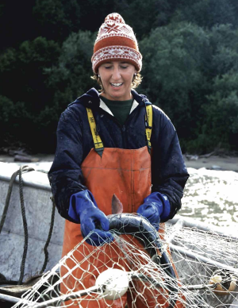

```{=html}
<div class="pub-brief-header">
  <p class="pub-source">Based on <a href="https://doi.org/10.1038/s41558-025-02482-z" target="_blank"><em>Pan-basin warming now overshadows robust Pacific Decadal Oscillation</em></a>, as published in <strong>Nature Climate Change</strong> (Cluett et al., 2025).</p>
</div>
```

---

In the winter of 1977, something shifted in the North Pacific. Across millions of square miles of ocean stretching from California to Alaska, sea surface temperatures quietly warmed. The water in the Eastern Pacific rose by nearly a degree. It was subtle enough that most people didn't notice, but the salmon did.

In a few years, fishers in the Gulf of Alaska were hauling in record catches of pink, sockeye, and coho salmon. At the same time, fish stocks along the coasts of California and Oregon were crashing. The shift was so synchronized and geographically distinct that scientists figured something large had to be driving it. What they traced it back to was a slow, decades-long oscillation of warm and cool water across the entire North Pacific. They named this pattern the **Pacific Decadal Oscillation**, or PDO.

For fishing communities and stock managers in Alaska, the PDO became their compass — something as close to a forecast as they could get. When it swung into a warm phase, salmon boomed. When it flipped cold, managers planned accordingly. Set quotas accordingly. Built fishing livelihoods accordingly.

Then, quietly, the forecast started getting it wrong.
{fig-align="center" width="30%"}

---

## What Is the PDO?

The Pacific Decadal Oscillation is not a storm or a single event. It is a decades-long pendulum of warm and cool water that reshapes the entire North Pacific. During its warm phase, sea surface temperatures rise along the western coast of North America while cooling in the central and western Pacific. During its cool phase, the pattern reverses. Like an inhalation and exhalation, the whole basin breathes in and out on a cycle of roughly 20–30 years.

::: {.callout-note appearance="minimal"}
**Think of it this way:** You've heard of El Niño. The PDO is its slower, larger cousin. While El Niño is a short-term event of periodic warming in the tropical Pacific lasting 9–12 months, the PDO's phases last decades, its reach extending across the entire North Pacific. The two can interact — amplifying or dampening each other's signals — but they are distinct phenomena driven by different dynamics.
:::

For fishing communities, this mattered enormously. When the PDO swings into its warm phase, conditions in the Gulf of Alaska cause salmon catches to boom. But that same warm phase brought the opposite to the California and Oregon coasts, where cooler, nutrient-rich waters that salmon and sardines depend on became harder to find. Two sides of the same coin.

PDO's consistency became so valuable that federal agencies like NOAA incorporated PDO forecasts into how they set catch limits and planned for shifts in fish populations. It wasn't just a scientific index — it was infrastructure. A shared language between oceanographers and a billion-dollar fishing industry.

---

## When the Compass Stopped Working

For decades the relationship held. But starting around 1989, the correlation between the PDO and salmon catches in the Gulf of Alaska began to weaken. By 2014, it had completely inverted. A positive PDO — which had reliably predicted good years for Alaskan salmon — was now predicting worse catches.

The compass wasn't just drifting. It was pointing south.

It wasn't only salmon. Indicator species across the North Pacific were responding to the PDO in ways that no longer matched the historical record. Scientists at UC Santa Cruz and NOAA's Southwest Fisheries Science Center in Monterey found the answer: **the PDO hadn't changed**. It was still oscillating as strongly as it always had. The problem was everything happening on top of it.

---

## A Second Force: Pan-Basin Warming

Over the past few decades, climate change has layered a second force onto the North Pacific — one that doesn't oscillate at all. The entire basin is now warming uniformly, without pause. Allison Cluett at UC Santa Cruz and her collaborators named this the **pan-basin warming pattern (PBP)**.

::: {.callout-important appearance="minimal"}
**The signal is still there. You just can't hear it anymore.** Pan-basin warming acts like a sound dampener. The PDO music is still playing — it's just being drowned out by a baseline that keeps rising.
:::

In 2014, the PDO and pan-basin warming surged in the same direction at once, producing the **"Blob"** — a marine heatwave that suffocated the Northeast Pacific and caused ecosystem-wide disruption from California to Alaska. Then in 2021, when the PDO flipped into its cold phase, it didn't cool the eastern Pacific as expected. The pan-basin warming was now strong enough to override it. For the first time on record, a cold PDO produced warm water.

---

## The Bell Curve That Explains Everything

To understand why the forecast inverted, Cluett and colleagues built a conceptual model. The results were striking.

{fig-align="center" width="80%"}

Salmon have a thermal sweet spot — the water temperature where they feed best, grow fast, and return in the numbers that fill nets. In the Gulf of Alaska, that sweet spot historically aligned with a warm PDO. When the index was positive, temperatures hit ideal conditions, and catches followed.

But pan-basin warming has raised the ocean's baseline temperature. Now the same PDO swing pushes past that sweet spot entirely. The salmon aren't getting a warm, productive year. They're getting water that is too hot.

> *Before 1989, the PDO was pushing catches up the left side of the curve. After 2014, it was pushing catches down the right side. Same signal. Same strength. Opposite outcome.*

---

## What This Means for Fisheries Management

The paper doesn't mince words. Management approaches built solely on historical PDO correlations will start to fail. The problem extends beyond salmon — researchers document weakened PDO correlations across ecosystem indicator species throughout the North Pacific.

The authors argue these approaches need to be replaced by **dynamic climate modeling** that accounts for both the PDO's natural oscillations and the rising pan-basin warming together. Using decades-old index correlations alone is no longer in the playbook.

The North Pacific may just be the first place where we are seeing the impacts clearly. Given how strong natural climate variability is in this region, the authors suggest that a similar overriding of climate signals is probably already occurring in ocean basins globally.

This is just a preview.

---

## The Instrument Isn't Broken. The Ocean Is.

The PDO isn't broken — it is still oscillating with the same strength it always has. Climate change has buried that signal under a warming ocean layer we have no historical analog for. Scientists didn't build the wrong instrument. The ocean the instrument was designed to read has fundamentally changed.

For fisheries managers from California to Alaska, and for the communities whose livelihoods depend on forecasts being right, the question is no longer whether the old playbook still works.

It's whether a new one can be written fast enough.

---

## Works Cited

Alaska Department of Fish and Game. (n.d.). *Triumph and tragedy: 1980–1989.* https://www.adfg.alaska.gov/static/fishing/PDFs/50years_cf/triumphtrag1980-1989.pdf

Cluett, A.A., Bograd, S.J., Jacox, M.G. et al. Pan-basin warming now overshadows robust Pacific Decadal Oscillation. *Nat. Clim. Chang.* **15**, 1340–1347 (2025). https://doi.org/10.1038/s41558-025-02482-z

```{=html}
<div class="disclaimer">
  <p>⚠ <strong>Note:</strong> This piece was written as a science communication assignment for EEMB 242 at UC Santa Barbara. It is shared here as a writing sample only and is not intended for profit or commercial reproduction. Figure 1 is reproduced from Cluett et al. (2025), <em>Nature Climate Change</em>, for educational purposes only.</p>
</div>
```
```{=html}
<style>
.pub-brief-header {
  background-color: rgba(32, 63, 81, 0.08);
  border-left: 4px solid #602013;
  padding: 1em 1.2em;
  margin-bottom: 1.5em;
  border-radius: 0 4px 4px 0;
}

.pub-source {
  margin: 0;
  font-size: 0.95em;
  color: #573F22;
}

blockquote {
  border-left: 4px solid #C8C081;
  padding-left: 1em;
  color: #573F22;
  font-style: italic;
}

.disclaimer {
  background-color: rgba(200, 192, 129, 0.2);
  border-left: 4px solid #C8C081;
  padding: 0.8em 1.2em;
  margin-bottom: 1.5em;
  font-size: 0.85em;
  color: #573F22;
  border-radius: 0 4px 4px 0;
}
</style>
```


