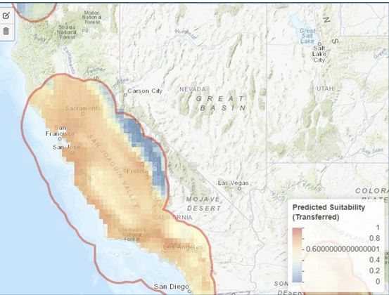
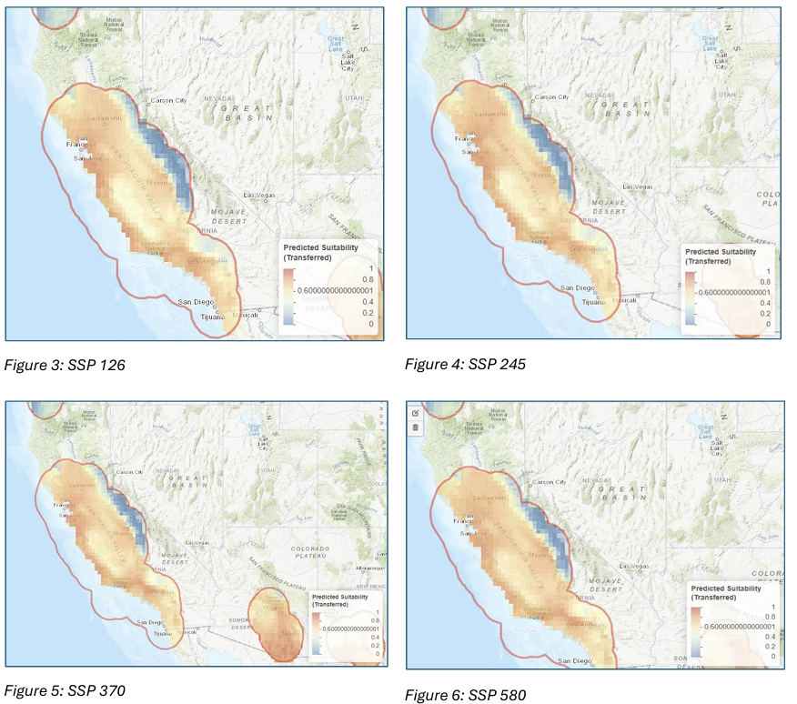

```{=html}
<div class="disclaimer">
  <p>⚠️ <strong>Note:</strong> These analyses were produced as coursework assignments for Climate Change Biology at UC Santa Barbara, Fall 2025. They are shared here as technical writing and modeling samples only.</p>
</div>
```

Two modeling exercises exploring how climate change reshapes biological and oceanographic systems — one terrestrial, one marine. The first uses Maxent species distribution modeling to project habitat suitability for *Eschscholzia californica* (California poppy) under multiple emission scenarios. The second downloads and interprets CMIP6 ocean climate model output to examine projected sea surface temperature patterns.

::: {.panel-tabset}

## Terrestrial SDM: California Poppy

```{=html}
<div class="pub-brief-header">
  <p class="pub-source"><strong>Assignment:</strong> Species Distribution Modeling in Wallace<br>
  <strong>Species:</strong> <em>Eschscholzia californica</em> (California coastal poppy)<br>
  <strong>Tool:</strong> Wallace v2.0 / Maxent via ENMeval<br>
  <strong>Data:</strong> GBIF occurrence records (n=337 → 56 thinned); WorldClim v2.1 bioclimatic variables at 10 arc-minute resolution</p>
</div>
```

### Background

*Eschscholzia californica*, the California state flower, is an iconic annual wildflower native to coastal regions and inland valleys of California. As a widespread native species, it provides early-season nectar resources for pollinators and contributes to California's distinctive spring wildflower displays. While currently not threatened, understanding how climate change may alter its distribution is important for maintaining native biodiversity and ecosystem function.

Recent research has revealed significant genetic variation across the species' range, with southern populations showing greater drought tolerance than northern populations. California is projected to experience substantial warming (2–5°C by 2100) and shifts in precipitation patterns, potentially restructuring suitable habitat for many native species. Species distribution modeling (SDM) offers a tool to anticipate these shifts and inform proactive conservation planning.

### Methods

SDM was conducted using the Maxent algorithm as implemented in Wallace v2.0 via ENMeval. Occurrence data were obtained from GBIF and spatially thinned to a 20 km minimum distance to reduce sampling bias, yielding 56 training points. Six bioclimatic variables from WorldClim were selected to capture California's Mediterranean climate:

| Variable | Description |
|----------|-------------|
| bio1 | Annual mean temperature |
| bio2 | Mean diurnal temperature range |
| bio5 | Maximum temperature of warmest month |
| bio6 | Minimum temperature of coldest month |
| bio12 | Annual precipitation |
| bio15 | Precipitation seasonality |

The model was validated using spatial block cross-validation (k=4) and evaluated using cloglog output. Future climate projections for 2061–2080 were generated using the ACCESS-CM2 global circulation model under four Shared Socioeconomic Pathways (SSP 126, 245, 370, and 585).

::: {.callout-note appearance="minimal"}
**Variable selection rationale:** bio15 (precipitation seasonality) captures California's wet winter/dry summer cycle; bio2 (diurnal temperature range) captures the coastal fog signature — small daily temperature swings that define the poppy's coastal niche. Temperature and water availability together are the primary constraints on *E. californica* distribution.
:::

### Results

#### Baseline Habitat Suitability

{fig-align="center" width="40%"}

The baseline model successfully captured the current distribution of *E. californica*, predicting high habitat suitability along the California coast and in interior valleys where occurrence records are concentrated.

#### Future Projections: SSP Comparison (2061–2080)

{fig-align="center" width="40%"}

The four SSP scenarios reveal a clear emissions-driven gradient in habitat expansion:

{fig-align="center" width="50%"}

| Scenario | Emission Level | Habitat Change | Central Valley Suitability |
|----------|---------------|----------------|---------------------------|
| SSP 126 | Low | Minimal | Low |
| SSP 245 | Medium | Moderate expansion | Medium |
| SSP 370 | Medium-High | Substantial expansion | High |
| SSP 585 | High | Maximum expansion | Very High |

Under SSP 126, suitable habitat remained largely like current conditions. As emission scenarios increased in severity, predicted suitable habitat expanded progressively northward and inland. Coastal suitable habitat remained stable across all scenarios — the primary differences occurred in interior areas. **This pattern suggests *E. californica* is currently temperature-limited rather than water-limited;** warmer temperatures appear to open previously unsuitable cooler interior regions.

### Variable Choice & Uncertainty

Different variables tell different stories. The model does not consider extreme drought events, winter chill hours, or fog data — all critical for coastal species. Temperature variables often correlate with each other, creating interpretation challenges when the model weights one variable heavily over a combination.

Scale also matters. At 10 arc-minute resolution (~20 km pixels), the model cannot capture microclimatic refugia such as fog-influenced coastal zones or north-facing slopes. The poppy is precipitation-limited, and climate models show less agreement on precipitation than temperature, contributing additional uncertainty. Using an alternative GCM would help explore this sensitivity.

::: {.callout-important appearance="minimal"}
**On eco-physical variables:** Including soil type, elevation, and vegetation community data would improve realism — *E. californica* prefers loamy, well-drained coastal soils and depends on specific pH and drainage conditions. However, future projections of these static variables are largely unavailable or poorly constrained. Adding static eco-physical variables assumes those features won't change, which contradicts the purpose of a climate projection. Dynamic variables like vegetation type would need their own future projections before being meaningfully incorporated — which is probably why most SDMs rely primarily on climate variables despite the limitations.
:::

### Management Recommendations

**1. Prioritize genetic integrity in restoration**
Southern populations exhibit greater drought tolerance, but hybridizing seed sources across regions could disrupt locally adapted coastal genotypes suited to fog-influenced environments. Restoration efforts should prioritize regionally sourced seed and develop regional seed banks that capture within-region variation without compromising genetic identity across ecozones.

**2. Integrate climate projections into habitat planning**
Use SDM outputs to guide restoration toward areas projected to remain or become suitable — particularly in the Central Valley and northern California under moderate to high emission scenarios. Avoid high investment in restoration in areas projected to lose suitability under high-emission scenarios. Focus on dynamic corridors that facilitate range shifts.

**3. Refine future models with non-climate variables**
Future SDMs should incorporate soil characteristics, vegetation community composition, and land use change data to constrain habitat predictions. Collaboration with land managers and soil ecologists could help identify barriers to natural recolonization in newly suitable areas.

### References

Harrison, S., Franklin, J., Hernandez, R. R., Ikegami, M., Safford, H. D., & Thorne, J. H. (2024). Climate change and California's terrestrial biodiversity. *PNAS*, *121*(32), e2310074121. https://doi.org/10.1073/pnas.2310074121

Ryan, E. M., & Cleland, E. E. (2021). Clinal variation in phenological traits and fitness responses to drought across the native range of California poppy. *Climate Change Ecology*, *2*, 100021. https://doi.org/10.1016/j.ecochg.2021.100021

Smither-Kopperl, M. L. (2018). *Plant guide for California poppy (Eschscholzia californica)*. USDA–NRCS Plant Materials Center.

---

## Ocean SDM: Sea Surface Temperature

```{=html}
<div class="pub-brief-header">
  <p class="pub-source"><strong>Assignment:</strong> Ocean Model Download & Plot<br>
  <strong>Model:</strong> GFDL-ESM4 (CMIP6 ScenarioMIP)<br>
  <strong>Ensemble member:</strong> r1i1p1f1 &nbsp;|&nbsp; <strong>Scenario:</strong> SSP5-8.5<br>
  <strong>Variable:</strong> Sea surface temperature (tos, °C) &nbsp;|&nbsp; <strong>Resolution:</strong> 1° × 1°</p>
</div>
```

### Background

Sea surface temperature (SST) reflects the thermal state of the upper ocean and directly impacts marine species' physiology, metabolism, and survival. It is one of the most consequential variables in climate biology — warming SST drives thermal stress, prey-driven species redistribution, and food web disruption across ocean systems.

This exercise downloads and visualizes SST output from the GFDL-ESM4 climate model under the SSP5-8.5 high-emission scenario (CMIP6), examining projected ocean conditions for January 2015 as a baseline time step.

### Model Metadata

| Parameter | Value |
|-----------|-------|
| Model | GFDL-ESM4 |
| Ensemble member | r1i1p1f1 |
| Scenario | SSP5-8.5 (ssp585) |
| Variable | tos (sea surface temperature) |
| Units | °C |
| Native resolution | 1° × 1° (lat/lon) |
| Global mean SST (first time step) | 12.63°C |

### Results

{fig-align="center" width="60%"}

The spatial pattern reflects characteristic ocean thermal structure: warm equatorial waters concentrated between 30°N and 30°S, with temperature declining sharply toward the poles. The global mean SST for this first time step is **12.63°C**.

### Reflections

#### What does SST tell us about ocean conditions?

SST captures the thermal state of the upper ocean layer and directly governs marine species' metabolic rates, growth, reproductive timing, and geographic ranges. It is one of the most widely used variables in ocean climate science precisely because it is measurable from both satellite and in situ platforms, and it integrates signals from atmospheric forcing, ocean circulation, and heat exchange.

However, SST alone has limitations. It only captures surface-level change. Mesopelagic temperatures (200–1000 m depth) matter because deeper waters can retain heat even after surface cooling, masking subsurface warming and potentially skewing assessments of ocean heat content and ecosystem recovery under future climate scenarios.

#### Conservation relevance: SST in species distribution models

SST can be incorporated directly into SDMs to predict where thermal conditions are suitable for a species to survive and reproduce. Temperature strongly influences physiology — metabolic rates, growth, and distribution limits all respond to thermal gradients. Incorporating SST identifies current and future habitat ranges under climate change, signals potential range shifts and habitat loss, and can reveal the emergence of newly suitable areas in previously cold regions.

For marine species with narrow thermal tolerances — coral reef systems, cold-water fish, marine mammals — SST projections under different SSPs can drive scenario planning for protected area design and fisheries management.

#### Temporal insight: using projections to guide decisions today

The downloaded file covers 2015–2034, though this figure displays only the January 2015 layer as a baseline. While a single time step doesn't show temporal trends, comparing it against later decades in the dataset would reveal how SST is projected to shift over the coming two decades under SSP5-8.5.

Studying these projections across future time steps helps conservation planners anticipate habitat shifts and design adaptive strategies before thermal thresholds become critical — before bleaching events become chronic, before species ranges contract past recovery thresholds, before fisheries management frameworks become obsolete.

---

:::

```{=html}
<style>
.pub-brief-header {
  background-color: rgba(32, 63, 81, 0.08);
  border-left: 4px solid #602013;
  padding: 1em 1.2em;
  margin-bottom: 1.5em;
  border-radius: 0 4px 4px 0;
}

.pub-source {
  margin: 0;
  font-size: 0.95em;
  color: #573F22;
  line-height: 1.8;
}

blockquote {
  border-left: 4px solid #C8C081;
  padding-left: 1em;
  color: #573F22;
  font-style: italic;
}

.disclaimer {
  background-color: rgba(200, 192, 129, 0.2);
  border-left: 4px solid #C8C081;
  padding: 0.8em 1.2em;
  margin-bottom: 1.5em;
  font-size: 0.85em;
  color: #573F22;
  border-radius: 0 4px 4px 0;
}

table {
  width: 100%;
  border-collapse: collapse;
  margin: 1.5em 0;
}

th {
  background-color: rgba(32, 63, 81, 0.15);
  color: #203F51;
  padding: 0.6em 1em;
  text-align: left;
}

td {
  padding: 0.5em 1em;
  border-bottom: 1px solid rgba(148, 136, 130, 0.3);
}
</style>
```
